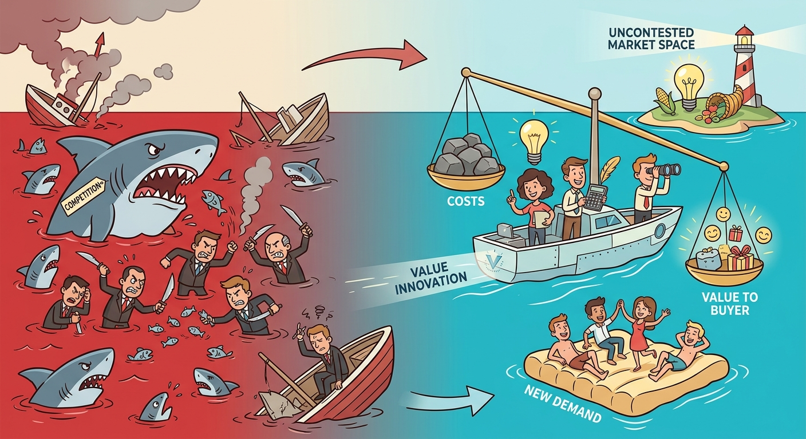

The concept of Blue Ocean Strategy illustrates a paradigm shift in business-level strategy, moving away from head-to-head competition to the creation of uncontested market spaces. This framework requires us to discuss how organizations achieve "Value Innovation" by simultaneously pursuing differentiation and low cost, thereby breaking the traditional value-cost trade-off. Consequently, our analysis justifies examining the core mechanisms of creating new demand, the distinction between red and blue oceans, and the strategic pathways used by firms to redefine industry boundaries and render rivals obsolete.

## Red Ocean vs. Blue Ocean Strategy

To understand the mechanics of market creation, we must first delineate the stark contrast between Red and Blue Oceans. "Red Oceans" represent all the industries in existence today—the known market space. In these environments, industry boundaries are defined and accepted, and the competitive rules of the game are well understood. Companies focus on beating the competition to grab a greater share of existing demand, forcing them to make a strict strategic choice between differentiation or low cost. As the market space gets crowded, prospects for profits and growth are reduced, turning the ocean "bloody" or red. 

Conversely, "Blue Oceans" denote all industries not in existence today—uncontested market space. In a Blue Ocean, competition is entirely irrelevant because the rules of the game have not yet been set. Instead of exploiting existing demand, the mechanism of a Blue Ocean Strategy focuses on creating and capturing *new demand*. The implication for strategic management is profound: rather than aligning the whole system of a company's activities with a definitive choice of *either* differentiation *or* low cost, the organization aligns its activities in pursuit of *both*. 

## Value Innovation and the Cost-Value Trade-off

At the very heart of Blue Ocean Strategy lies the concept of "Value Innovation." Value innovation occurs only when companies align innovation with utility, price, and cost positions. Traditional strategic paradigms dictate that companies must make a strict "Cost-Value Trade-off"—the belief that value creation inherently costs more, and low cost can only be achieved by compromising on value. Blue Ocean Strategy breaks this trade-off by seeking simultaneous differentiation and low cost.

The mechanism to achieve this is often operationalized through the Four Actions Framework (Eliminate, Reduce, Raise, Create). The case of *easyJet* perfectly illustrates this implementation. To break the trade-off and create a Blue Ocean in the airline industry, easyJet systematically evaluated standard industry factors:
*   **Eliminate:** They completely removed costly elements the industry took for granted, such as in-flight meals, travel agents, and flight connections.
*   **Reduce:** They reduced flexibility in changing flights and the ability to pre-select seats well below industry standards.
*   **Raise:** They raised punctuality and the emphasis on low cost well above the industry standard.
*   **Create:** They introduced entirely new value elements, such as ticket-less travel and a policy of providing refunds if flights were delayed.
The implication of these combined actions is a reimagined value chain that significantly lowers operational costs while dramatically increasing the buyer value proposition.

## Strategic Pathways to Uncontested Market Space

Creating a Blue Ocean is not about predicting the future; it involves a systematic process of reconstructing market boundaries. Firms can unlock new demand by looking across conventional industry boundaries using specific strategic pathways:
1.  **Looking Across Alternative Industries:** Rather than just looking at direct competitors, firms can analyze substitutes and alternatives. For example, *Southwest Airlines* and the *Tata Nano* looked beyond traditional direct rivals to capture demand from entirely different transportation modes.
2.  **Looking Across Strategic Groups:** Companies can break out of their narrow strategic group by understanding what influences customers to trade up or down, much like *Toyota's Lexus* did by bridging the gap between luxury and reliability.
3.  **Redefining the Industry Buyer Group:** Shifting focus from the traditional target buyer (e.g., from purchasing agents to end-users) can unlock vast new value, as seen when *Canon* shifted the photocopier market to desktop target buyers.
4.  **Looking Across Complementary Products and Services:** Identifying what happens before, during, and after a product is used can reveal hidden pain points. *NABI* in the bus transit industry successfully captured value by looking at the lifecycle costs of municipalities.
5.  **Rethinking the Functional-Emotional Orientation:** Changing the appeal of an industry can create new demand. *Starbucks* successfully shifted coffee from a functional commodity to an emotional, experiential product.
6.  **Shaping External Trends Over Time:** Rather than merely adapting to external trends as they occur, firms can actively participate in shaping them to create Blue Oceans, just as *Apple* did with the iPod by reshaping the digital music ecosystem.

In conclusion, Blue Ocean Strategy represents a transformative approach that enables firms to escape saturated, highly competitive markets by systematically reconstructing industry boundaries. By pursuing value innovation, organizations successfully break the traditional cost-value trade-off, achieving simultaneous differentiation and cost leadership. Through the application of actionable frameworks and the exploration of multiple strategic pathways, companies can move beyond fighting over existing customers and instead unlock vast, uncontested market spaces that render the competition entirely irrelevant.