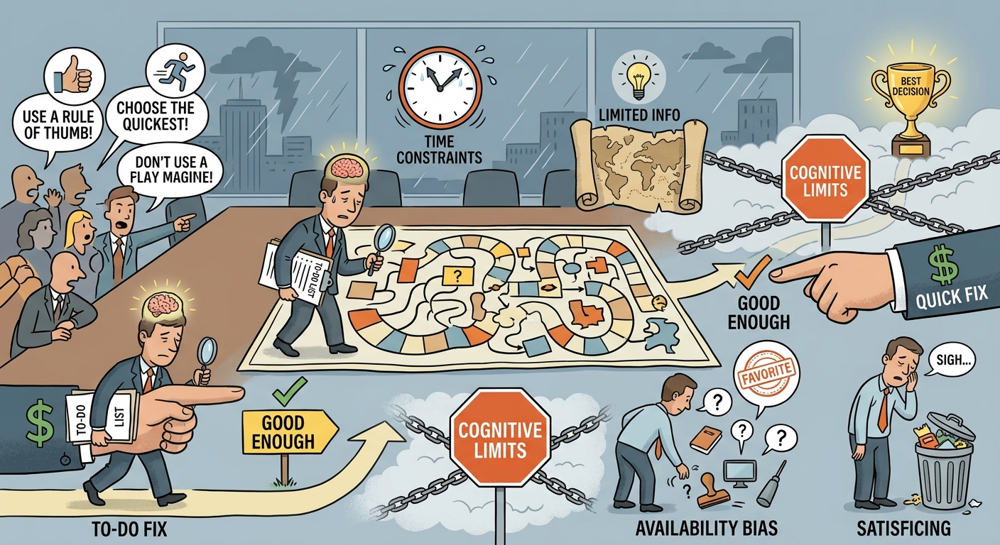

The concept of Bounded Rationality illustrates how strategic decision-making is fundamentally constrained by human cognitive limitations, finite time, and imperfect information. Analyzing this concept requires us to discuss the departure from classical economic rationality, focusing instead on how executives actually process complex, high-stakes strategic choices. This note justifies the prevalence of specific decision-making mechanisms in the real world, exploring three key dimensions: the inherent constraints on executive cognition, the reliance on satisficing behavior, and the vulnerability to cognitive heuristics like availability bias.

## Cognitive and Environmental Constraints
Strategic decisions are inherently complex, involving large financial outlays, cross-functional implications, and highly uncertain outcomes. According to classical economic theory, decision-makers should evaluate all possible alternatives to maximize firm value. However, bounded rationality dictates that executives operate under severe limitations: *limited knowledge*, *finite cognitive capacity*, and strict *time constraints*. In highly dynamic industries—such as the rapidly shifting technological landscapes seen in the *Apple* case or the complex regulatory environments of the *Indian Auto Industry*—it is physically and mentally impossible for managers to gather and process every piece of relevant data. Consequently, the strategic management process cannot rely on pure, unconstrained rational planning, but must instead adapt to the reality of imperfect information processing.

## The Mechanism of Satisficing Behavior
Because mathematical optimization is impossible under the constraints of bounded rationality, decision-makers employ *satisficing behaviour*. Rather than exhaustively searching for the absolute optimal choice, executives search through available alternatives only until they find an option that meets an acceptable threshold of performance. Satisficing acts as a practical heuristic mechanism that balances the cost and delay of prolonged information gathering against the urgent need for strategic action. For example, when retail brands like *Tanishq* or *Café Coffee Day* scale their operations, managers cannot perfectly calculate the optimal layout or location out of millions of possibilities; instead, they satisfice by selecting locations that meet specific, pre-defined criteria for foot traffic and cost, allowing the firm to execute its strategy swiftly and maintain competitive momentum.

## Susceptibility to Availability Bias and Heuristics
The limitations imposed by bounded rationality force strategists to rely on mental shortcuts (heuristics), which frequently introduces cognitive biases into the strategy formulation process. A primary consequence is the *availability bias*, wherein executives base their strategic judgments on information that is most easily recalled, emotionally resonant, or recently acquired. In hyper-competitive environments, such as the *Cola Wars* between Coke and Pepsi, availability bias might cause a firm to overreact to a competitor's most recent marketing maneuver simply because it is highly salient in the executives' minds, rather than objectively analyzing long-term industry structures. To mitigate the negative implications of bounded rationality and availability bias, organizations must implement formal analytical frameworks—such as Porter's Five Forces, Value Chain Analysis, and structured Scenario Planning—to force a more comprehensive evaluation of the external and internal environment.

In conclusion, bounded rationality underscores the realistic boundaries of human cognition within the strategic management process. By acknowledging the inescapable limitations of time, knowledge, and mental processing power, strategists can better understand why decision-making inevitably defaults to satisficing behaviors and cognitive shortcuts. Ultimately, recognizing these inherent constraints allows organizations to design robust analytical processes and governance structures that actively counter availability bias, ensuring more resilient, objective, and effective strategic choices.