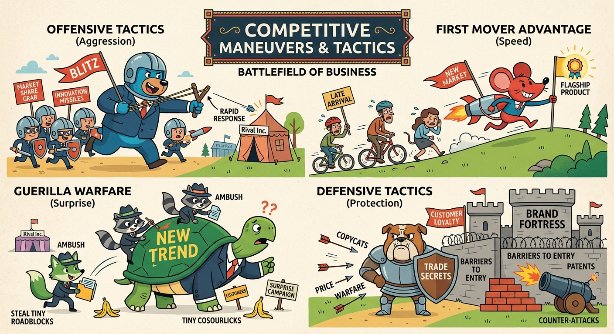

The study of business-level strategy requires us to discuss the specific competitive maneuvers and tactics a firm executes to engage with, preempt, or defend against rivals in the marketplace. Analyzing these deliberate actions illustrates how organizations translate their overarching generic strategies into dynamic, real-time market combat, navigating the tension between creating value and capturing market share. This topic justifies a thorough examination of three primary dimensions: offensive tactics designed to seize the initiative, defensive tactics aimed at protecting competitive positioning, and the contextual application of these maneuvers based on a firm's relative market standing. 

## Offensive Tactics and Market Preemption
Offensive tactics are proactive maneuvers designed to take the initiative, control the competitive narrative, and capture market share. These actions can be broadly categorized into *anticipatory* maneuvers (preemption) and *engagement* maneuvers (direct attack). Preemption involves taking strategic actions before rivals can respond, such as "Pioneering" to establish a First Mover Advantage, or "Capturing" critical assets like prime real estate or exclusive distribution channels. Apple’s introduction of the iPhone illustrates a pioneering maneuver that preempted traditional handset manufacturers by fundamentally redefining the smartphone value proposition. When a firm chooses direct engagement, it may launch a "Frontal Assault" by attacking a competitor's strengths head-on—as seen in the *Cola Wars* when Pepsi launched the "Pepsi Challenge" to directly contest Coca-Cola's taste dominance. Alternatively, firms may utilize "Flanking Maneuvers" to attack a competitor's blind spots in uncontested segments, or "Encirclement" to pressure the rival across multiple fronts simultaneously. 

## Defensive Tactics and Competitive Deterrence
Defensive tactics aim to protect the status quo, defend a firm’s competitive advantage, and react to unfolding market threats. Like offensive moves, defensive tactics operate on two levels: *anticipatory deterrence* and *tactical response*. Deterrence focuses on preventing an attack before it happens by "Raising structural barriers" (e.g., leveraging economies of scale, tying up suppliers, or creating high customer switching costs) or by "Increasing expected retaliation" through aggressive market signaling. For instance, Coca-Cola and Pepsi frequently utilized their massive, capital-intensive bottling networks as structural barriers to deter new entrants. When deterrence fails, firms must deploy response tactics. These include launching a direct "Counterattack," adopting a "Fast Follower" strategy to rapidly imitate a challenger's successful innovation (such as Coke fast-following Pepsi into the diet and non-carbonated beverage spaces), or strategically executing "Retrenchment" and "Withdrawal" to cede unprofitable ground and consolidate resources around core competencies.

## The Strategic Square and Contextual Application
The successful deployment of competitive maneuvers relies heavily on a firm’s structural position within its industry, a concept encapsulated by the "Strategic Square." This framework dictates that *Defensive Warfare* should be the exclusive domain of market leaders, whose primary objective is to courageously attack their own obsolescence and block strong competitive moves (e.g., Apple's continuous self-disruption of the iPod with the iPhone). *Offensive Warfare* is strictly for No. 2 companies possessing the resource capability to find a weakness in the leader's strength and strike narrowly (e.g., Pepsi's historical targeting of Coke's younger demographic). *Flanking Warfare* is reserved for smaller companies that must rely on tactical surprise in uncontested areas to build a foothold. Finally, *Guerrilla Warfare* requires local or regional companies to find a market segment small enough to defend via quick, hit-and-run maneuvers, avoiding direct retaliation from industry giants—as demonstrated by regional upstarts like Kola-Real capturing hyper-local market share in the Latin American soft drink market. A firm's chosen tactical quadrant must be rigorously supported by its underlying VRIO (Valuable, Rare, Inimitable, Organized) resources to ensure strategic viability.

In conclusion, understanding competitive maneuvers and tactics reveals the critical mechanics of how strategic formulation transitions into actionable market execution. Firms must continuously calibrate their offensive and defensive maneuvers—whether through pioneering preemption, direct frontal assaults, structural deterrence, or rapid counterattacks—to navigate industry rivalry. Ultimately, securing and sustaining a competitive advantage depends not only on selecting the right tactical maneuver but also on aligning that action flawlessly with the firm's resources, industry position, and the broader competitive dynamics of the strategic square.