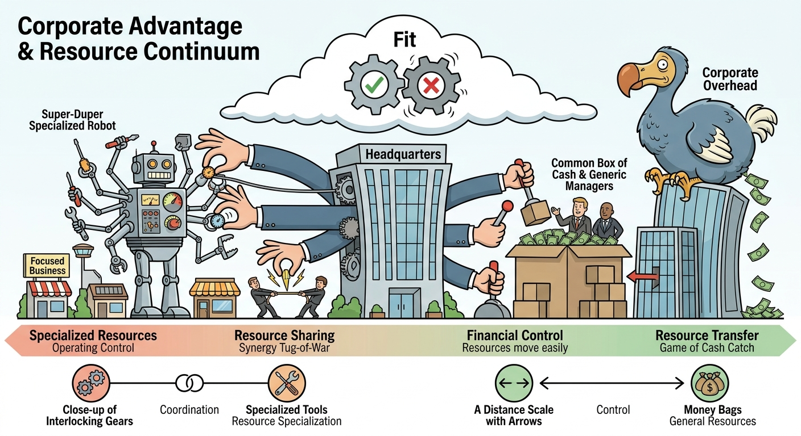

The study of Corporate Advantage and the Resource Continuum requires us to discuss how multibusiness firms generate value that strictly exceeds the mere sum of their individual business units. This framework illustrates that a firm's unique assets and capabilities fall along a continuum from highly specialized to highly general, which intrinsically justifies the appropriate competitive scope of its portfolio. Furthermore, mastering this topic necessitates an exploration of three key dimensions: the alignment of resources with business scope, the deployment of coordination mechanisms (sharing vs. transferring), and the selection of optimal control systems (operating vs. financial) alongside appropriate corporate overhead.

## The Resource Continuum and Business Scope
The foundation of corporate advantage lies in the "Triangle of Corporate Strategy," which demands absolute alignment between a firm's resources, its businesses, and its organizational structure. The nature of a firm's resources—mapped on a continuum from specialized to general—dictates its optimal business scope. At one extreme, firms with highly specialized resources must restrict themselves to a narrow range of businesses. For example, Sharp Corporation leverages specialized optoelectronics and LCD technology, confining its scope to consumer electronics where that specific technological advantage can be exploited. At the opposite extreme, firms possessing highly general resources, such as Tyco International’s expertise in strict financial controls and corporate governance, can operate across a vastly wide and unrelated scope of businesses. In the middle of the continuum sit companies like Newell, whose resources (relationships with mass discount retailers and high-volume manufacturing expertise) allow for a moderate scope of non-seasonal, low-tech consumer goods. The critical mechanism for success is defining relatedness by underlying resources rather than superficial product characteristics; failing to respect this boundary destroys corporate value.

## Coordination Mechanisms: Resource Sharing vs. Resource Transfer
Once the business scope is defined, a multibusiness firm must determine how to coordinate its activities to extract synergies, which is directly dictated by the resource continuum. Resources generally act as either "public goods" or "private goods." General and moderately specific resources often function as public goods (e.g., best practices, brand names) and can be *transferred* across divisions with minimal conflict. Newell exemplifies this by transferring experienced managers and merchandising capabilities across its autonomous product divisions without needing complex integration. Conversely, highly specialized resources often act as private goods (e.g., centralized R&D, shared manufacturing plants) and must be *shared* simultaneously by multiple units. Resource sharing is highly complex and prone to territorial conflict. Consequently, companies like Sharp must utilize heavy coordination mechanisms, such as matrix structures, cross-unit committees, and elite integration teams (e.g., Sharp's "Gold Badge" projects), to force collaboration and manage the inevitable trade-offs between competing divisions. 

## Organizational Control Systems and Corporate Fit
The final dimension of corporate advantage requires aligning the firm's control systems and corporate overhead with its coordination needs. Firms on the general end of the continuum (Tyco) thrive on strict *financial controls*, evaluating autonomous division heads purely on objective financial outputs (e.g., profitability, ROE) and rewarding them with uncapped bonuses. Because no integration is required, Tyco operates with a minimalist corporate office and a "no meetings, no memos" culture. Conversely, firms on the specialized end (Sharp) must employ *operating controls*. Because business units share resources and financial outcomes are interdependent, managers cannot be judged solely on isolated divisional profits. Instead, Sharp evaluates managers on behaviors, technological milestones, and teamwork, utilizing long-term incentives like promotion rather than short-term cash bonuses. This heavy integration justifies a large, deeply involved corporate headquarters. When a firm misaligns its controls with its resources—such as Saatchi & Saatchi disastrously applying strict financial headcount controls to a highly integrated, creative advertising business—the strategic fit collapses, resulting in severe value destruction.

## Conclusion
Achieving corporate advantage is not a matter of adopting a universal best practice, such as aggressive downsizing or unrelated diversification, but rather an exercise in strategic consistency. A firm must continuously evaluate where its core capabilities lie on the resource continuum to determine its optimal portfolio boundaries. By aligning the scope of the business, the degree of resource sharing or transferring, and the balance of operating versus financial controls, executives construct a unified strategic system. Ultimately, multibusiness firms succeed only when their organizational structure and corporate overhead perfectly match the nature of their resources, ensuring that the corporate center actively multiplies value rather than acting as an administrative burden.