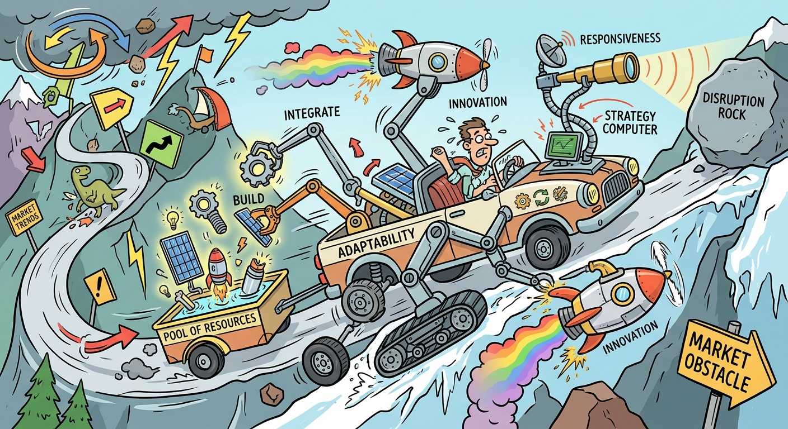

The study of Dynamic Capabilities requires us to discuss how firms adapt to and capitalize on high-velocity markets where traditional, static resource advantages inevitably break down. This concept illustrates a firm's capacity to deliberately modify, deepen, or augment its existing resource base and competencies to achieve sustained competitive advantage in rapidly changing environments. An analysis of dynamic capabilities justifies the need for continuous organizational learning, rapid product innovation, and the effective reconfiguration of both internal and external assets. Consequently, examining this topic reveals three key dimensions: overcoming the limitations of the traditional Resource-Based View (RBV), the strategic mechanisms for capability reconfiguration, and the imperative of continuous adaptation across dynamic case environments.

## Overcoming the Static Limitations of the Resource-Based View (RBV)
The traditional Resource-Based View relies on identifying internal resources that are Valuable, Rare, Imperfectly Imitable, and Non-substitutable (VRIN) to establish a sustainable competitive advantage. However, the RBV framework breaks down in "High Velocity Markets" because the duration of any competitive advantage is highly unpredictable when facing rapid technological or regulatory shifts. Dynamic capabilities bridge this theoretical gap by shifting the focus toward the organization's adaptability and responsiveness. Winners in the global marketplace do not merely sit on a static portfolio of assets; instead, they demonstrate timely responsiveness, rapid and flexible product innovation, and the management capability to effectively coordinate and redeploy internal and external competencies. It is this proactive agility, rather than the mere possession of resources, that drives long-term survival in volatile industries.

## Mechanisms of Capability Modification and Reconfiguration
Dynamic capabilities manifest strategically through two primary mechanisms: incrementally improving existing resources and deliberately adding entirely new capabilities. First, firms can deepen existing competencies through continuous improvement and focused innovation. For example, Toyota effectively leverages dynamic capabilities by aggressively upgrading its fuel-efficient hybrid engine technology while simultaneously fine-tuning its famed Toyota Production System (TPS). Second, firms can add new capabilities to their competitive asset portfolio through strategic alliances, acquisitions, and integration. CISCO, for instance, relies on its unique, deeply embedded capability of acquiring and rapidly integrating other technology firms to capture new market spaces. At the corporate level, generating sustained "Corporate Advantage" demands that firms like Sharp and Newell continually upgrade their resource continuum—either by systematically sharing complex technological competencies or by transferring managerial best practices across disparate business units to build new competitive postures.

## Strategic Adaptation and Continuous Learning in Practice
The practical application of dynamic capabilities requires a relentless commitment to organizational learning and strategic transformation amidst disruption. Apple Inc. provides a quintessential example of dynamic adaptation; under Steve Jobs and Tim Cook, the firm continuously reconfigured its ecosystem to preempt market stagnation. By leveraging its core design and software integration competencies, Apple shifted from Mac computing to dominating the smartphone industry with the iPhone, and subsequently built massive new capabilities in Wearables (Apple Watch, AirPods), Services (Apple Pay, Apple Music), and advanced Artificial Intelligence (Vision Pro spatial computing and autonomous systems). Similarly, Biocon transformed from a basic enzyme manufacturer into a global biotech powerhouse by progressively building complex, high-risk capabilities in biopharmaceuticals, clinical trials, and proprietary drug discovery. Furthermore, as highlighted by modern workforce strategy frameworks, disruptive shifts—such as the integration of agent-led Artificial Intelligence—mandate that firms dynamically adapt by flattening team structures, redefining tasks, and continuously upskilling human talent to maintain operational agility.

In conclusion, dynamic capabilities represent the critical managerial mechanisms that allow firms to survive and thrive amidst environmental turbulence and competitive disruption. By moving beyond the static constraints of the traditional Resource-Based View, organizations can systematically integrate, build, and reconfigure their asset bases to match the rigorous demands of high-velocity markets. Ultimately, sustained competitive advantage relies not merely on the initial possession of unique resources, but on the relentless organizational capacity to adapt, learn, and reinvent operational frameworks and strategic postures over time.