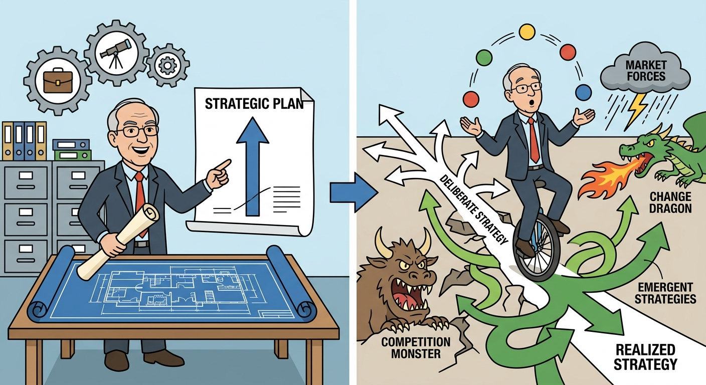

The dichotomy between emergent and intended strategy illustrates the fundamental tension between rational planning and organizational adaptability in dynamic business environments. Analyzing this framework justifies why rigid adherence to initial blueprints often fails, and requires us to discuss the evolutionary nature of strategic management as conceptualized by Henry Mintzberg. Specifically, this evaluation explores three key dimensions: the inherent fragility of top-down intended strategies, the adaptive mechanisms driving emergent strategies, and the ultimate synthesis of these forces into a firm's realized strategy. 

## The Formulation and Fragility of Intended Strategy
Intended strategy represents the proactive, rational planning process wherein top management defines a firm’s vision, allocates resources, and sets deliberate goals to achieve a competitive advantage. In the *Delta/Signal Corp.* case, the new CEO formulates highly specific intended strategies (e.g., targeting the luxury segment via innovation versus the economy segment via low costs) and attempts to institutionalize them using a Balanced Scorecard to ensure deliberate execution. However, strategic management theory dictates that a significant portion of intended strategies become "unrealized" due to bounded rationality, shifting macroeconomic conditions, and unpredictable competitor actions. When a firm operates in a highly volatile market, an overly rigid intended strategy can become a core rigidity. For instance, *Reliance Retail's* initial intended strategy was strictly focused on building India’s largest brick-and-mortar retail network, a deliberate plan that failed to account for the imminent digital revolution that would soon disrupt the retail landscape.

## The Adaptive Mechanisms of Emergent Strategy
Emergent strategy arises spontaneously as organizations learn, adapt, and respond to unforeseen external forces or internal serendipity, operating outside the boundaries of the original strategic plan. This bottom-up strategic evolution is a mechanism of organizational learning rather than formal planning. The classic illustration of this phenomenon is *Honda’s entry into the US motorcycle market*: Honda's intended strategy was to sell 250-350cc motorcycles to confirmed enthusiasts, which failed miserably. The emergent strategy surfaced when executives used 50cc Honda Cubs to run errands around Los Angeles, inadvertently catching the attention of Sears Roebuck and unlocking a massive, untapped market of non-bikers. Similarly, in the *Tanishq* case, the initial intended strategy of selling 18-karat, Western-style jewelry to the "super haves" was met with market rejection ("nice, but not for me"). Tanishq's emergent response was to pivot toward the traditional 22-karat Indian wedding market and pioneer the in-store "Karatmeter" to expose competitor under-karatage. This adaptive maneuver allowed the brand to capture the mainstream market through learning rather than initial foresight.

## Synthesizing Deliberate and Emergent Forces into Realized Strategy
A firm's actual "realized strategy" is rarely a pure execution of its original plan; rather, it is the hybrid culmination of deliberate strategies that were successfully implemented and emergent strategies that were successfully integrated. Effective strategic leadership requires balancing the discipline of intended frameworks with the agility to absorb emergent opportunities. In the case of *Apple Inc.*, Steve Jobs's intended strategy was to maintain a strictly closed ecosystem, famously vowing that the iPod would become Windows-compatible "over his dead body" and initially resisting the creation of a third-party App Store. However, executive pushback and market realities forced an emergent adaptation. By opening the iPod to Windows users and launching the App Store, Apple fused its deliberate hardware focus with an emergent software platform, resulting in a realized strategy that drove the company to a multi-trillion-dollar valuation. Likewise, *Reliance Retail's* realized strategy successfully combined its deliberate physical store rollout with emergent digital spillovers from the Jio ecosystem, ultimately creating a dominant hybrid (phygital) retail model. 

In conclusion, the study of intended versus emergent strategy demonstrates that strategic management is an ongoing, dynamic process rather than a static administrative event. While intended strategies provide essential direction and alignment, emergent strategies supply the necessary agility to survive market complexities. Ultimately, competitive advantage belongs to firms that can effectively execute deliberate plans while simultaneously cultivating the organizational flexibility to embrace and integrate emergent market realities into a successful realized strategy.