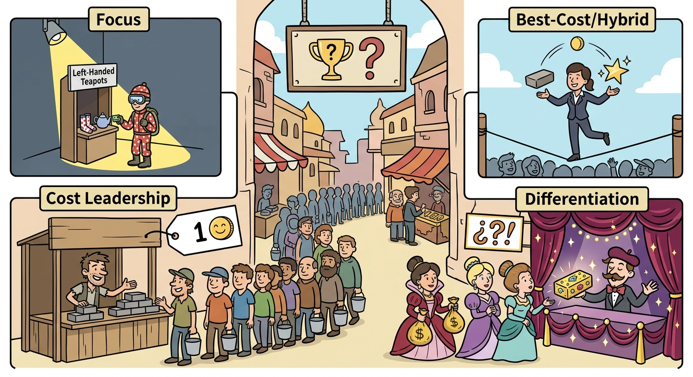

This study note explores Porter’s generic competitive strategies, a foundational framework that requires us to discuss how firms configure their internal value chains to secure a sustainable competitive advantage. The framework illustrates that businesses must choose a distinct strategic position—ranging from broad cost leadership and differentiation to narrow focus or a hybrid best-cost approach—to effectively capture market share. Analyzing these strategic typologies justifies the fundamental necessity of making deliberate operational trade-offs, demonstrating that attempting to be "all things to all customers" inevitably dilutes a firm's value proposition and destroys long-term profitability. 

## Low-Cost Leadership: Efficiency and Value Chain Reconfiguration
The Low-Cost Leadership strategy requires a firm to provide products or services at a lower cost than its competitors while targeting a broad, "average" customer base. The mechanism for achieving this advantage relies on two primary approaches: fundamentally performing value chain activities more efficiently (e.g., capturing learning/experience curve effects, maximizing economies of scale, tightly controlling production overhead) or completely reconfiguring the value chain to bypass cost-producing activities (e.g., cutting out distributors, simplifying product design). The strategic implication of this approach is the ability to either pass savings to customers to aggressively gain market share or retain the going market price to earn superior profit margins. In the *Delta/Signal* case, the EVP of Manufacturing proposed a "Low Initial Cost" strategy targeting economy-segment OEMs (like Tata and Kia), requiring the firm to maximize plant capacity and build deep expertise in low-cost procurement and assembly-line efficiency to ride the wave of emerging market growth.

## Differentiation Strategy: Commanding Premium Value
A Differentiation Strategy requires a firm to incorporate unique, hard-to-copy features that buyers perceive as highly valuable, allowing the firm to command a premium price and build fierce brand loyalty. The mechanisms of differentiation can be functional (raising product performance or lowering the buyer's overall lifetime costs) or intangible (enhancing emotional or brand satisfaction). The implication of this strategy is that it protects against competitive rivalry by creating high switching costs and reducing price sensitivity. *Nestlé’s* strategic transformation under CEO Peter Brabeck vividly illustrates this: the firm transitioned from selling commoditized, raw-materials-based foods to a highly differentiated Nutrition, Health, and Wellness (NHW) positioning (e.g., introducing the 60/40+ quality metric and proprietary R&D). Similarly, *Delta/Signal’s* R&D department advocated for an "Innovation" strategy targeting luxury OEMs, relying on leading-edge, proprietary technologies that commanded high margins and protected intellectual property.

## Focus Strategies: Niche Market Dominance
Focus Strategies involve a concentrated attention on a narrow, specific segment of the total market, serving niche buyers better than broad-market rivals. A firm can pursue either a *Focused Cost Leadership* strategy (achieving lower costs within the niche) or a *Focused Differentiation* strategy (offering highly specialized attributes). The mechanism relies on choosing a market niche where buyers have distinct preferences that multi-segment competitors find too costly or difficult to accommodate. The implication is that deep, localized expertise acts as an isolating mechanism against larger incumbents. In *Delta/Signal*, the EVP of Customer Service proposed a Focused Differentiation approach termed "Customer Integration." By intimately integrating R&D, manufacturing, and shipping processes with a select few luxury OEMs, the firm could insulate itself from broad market fluctuations and secure highly profitable, premium-paying partnerships.

## Best Cost (Hybrid) Strategy and the Imperative of Strategic Trade-Offs
The Best Cost (Hybrid) Strategy aims to deliver superior value by incorporating upscale, differentiated attributes at a lower cost than rivals, specifically targeting "value-conscious" rather than purely price-conscious buyers. However, attempting this requires rigorous strategic discipline. As established in the foundational principles of strategy, positioning requires choosing what *not* to do. Without strict trade-offs, firms fall into the perilous trap of "straddling"—trying to imitate rivals without abandoning an old position—which leads to organizational confusion and collapsed margins. The implication of failing to manage these trade-offs is being "stuck in the middle," squeezed simultaneously by pure low-cost producers and high-end differentiators. *Delta/Signal’s* new CEO, Brian Nielson, recognized this exact failure in his predecessor's strategy: by producing 2,000 distinct products across 100 separate lines without being a leader in anything, the firm lacked a concise value proposition, resulting in substandard operational and financial performance.

Concluding, a firm's survival and superior profitability strictly depend on its commitment to a definitive generic competitive strategy. Whether a firm chooses to dominate through scale-driven cost leadership, premium differentiation, or a highly tailored focus approach, it must align its entire value chain—from procurement to corporate culture—behind that singular choice. Failing to make these foundational strategic trade-offs leaves an organization vulnerable to competitive imitation and structural inefficiency, proving that sustainable advantage is born exclusively from focused, deliberate positioning.