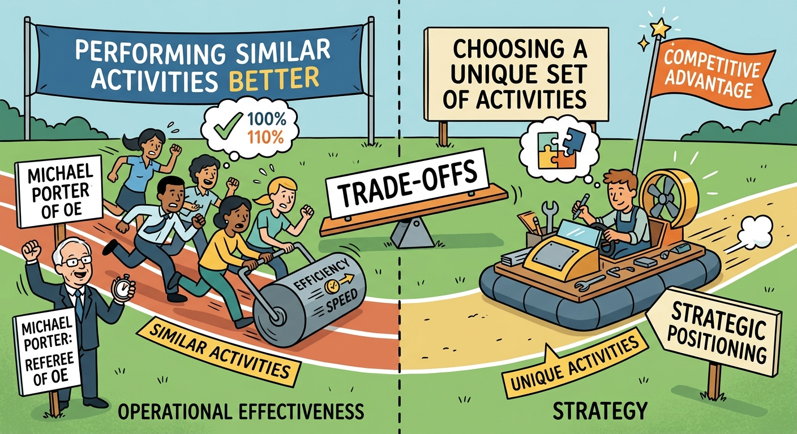

The fundamental distinction between Operational Effectiveness (OE) and Strategy illustrates how organizations achieve and sustain competitive advantage in highly competitive markets. Analyzing this concept, as conceptualized by Michael E. Porter, requires us to discuss the inherent limitations of merely performing similar activities better than rivals and justifies the absolute necessity of crafting a unique strategic position. This examination explores three critical dimensions: the productivity frontier trap of operational effectiveness, the architecture of strategic positioning, and the critical role of trade-offs in preventing strategic convergence and the dangers of straddling. 

## The Trap of Operational Effectiveness (OE) and Strategic Convergence
Operational effectiveness refers to performing similar activities *better* than rivals perform them. This includes initiatives focused on efficiency, cost reduction, quality improvement, digitization, and benchmarking (such as TQM, Six Sigma, or the Kaizen defect-reduction programs observed in the *Delta/Signal Corp.* case). While OE is essential for survival, it is not strategy. The fundamental mechanism that undermines OE as a sustainable advantage is rapid diffusion; best practices are easily observable and quickly copied by competitors. As all firms in an industry continuously benchmark and adopt these practices, they mutually push the "productivity frontier" outward. This results in strategic convergence, where competitors become indistinguishable from one another, ultimately leading to price wars and margin collapse. A prime industry example of this phenomenon is the Indian IT services sector, where giants like Infosys, TCS, and Wipro historically converged on highly similar delivery models, eroding their ability to command premium pricing based on operational execution alone.

## Strategic Positioning: Choosing to be Different
If OE is about doing things better, Strategy is about being *different*. Strategy means deliberately choosing a unique position through a tailored, differentiated set of activities. It definitively answers who to serve, what specific needs to fulfill, and how to operate differently from rivals. Porter identifies three distinct, non-mutually exclusive bases for strategic positioning. First, *Variety-based positioning* involves focusing on a narrow, deep set of products or services, deriving efficiency from specialization (e.g., Dr. Lal PathLabs focusing exclusively on diagnostics). Second, *Needs-based positioning* focuses on serving most or all the needs of a specific, targeted customer segment, tailoring the entire value chain to that group (e.g., IKEA targeting young, price-sensitive buyers, or Hero MotoCorp focusing deeply on daily commuters). Third, *Access-based positioning* segments customers who are accessible in radically different ways, requiring a distinct geographic or scale-based activity system (e.g., Bandhan Bank's focus on rural doorstep banking). Through these positions, firms like IndiGo have built sustainable advantages by designing a fundamentally different activity system (point-to-point, single aircraft type) rather than simply trying to run a full-service airline more efficiently.

## The Imperative of Trade-offs and the Danger of Straddling
A chosen strategic position is only sustainable if it is protected by trade-offs. Strategy fundamentally requires a firm to choose what *not* to do. Trade-offs create friction for competitors attempting to imitate a successful firm, because copying the strategy would require abandoning their own established positions. For instance, FMCG giant HUL cannot simply adopt Patanjali's specific "Ayurvedic/Swadeshi" ideology without severely diluting its own established, multinational brand equity. When firms refuse to make trade-offs, they fall into the trap of "straddling"—attempting to graft a rival's new competitive position onto their existing operational model. Straddling inevitably leads to organizational confusion, conflicting internal priorities, higher costs, and market failure. This was clearly evidenced when traditional telecom incumbents attempted to straddle their legacy billing models against Jio's disruptive data-first entry. Similarly, the historical struggles of *Delta/Signal Corp.* highlight this danger: by trying to be "all things to all customers" and producing 2,000 distinct products without a clear value proposition, the company suffered substandard financial results until new leadership forced a choice between distinct low-cost or innovation-focused strategic paths. 

In conclusion, while achieving operational excellence is a necessary baseline for market participation, it is wholly insufficient for long-term profitability. The juxtaposition of operational effectiveness and strategy demonstrates that sustainable competitive advantage stems from deliberate, unique strategic positioning rather than continuous incremental improvements. By committing to specific target segments, establishing unique activity systems, and strictly enforcing strategic trade-offs, firms insulate themselves from the pressures of competitive convergence and the costly pitfalls of straddling, thereby securing a distinctive and defensible market position.