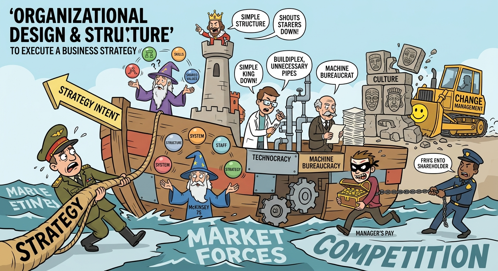

The study of Organizational Design and Structure *illustrates* how the alignment of reporting lines, cultural norms, and administrative processes is critical for the effective execution of strategic intent. The dynamic nature of modern business environments *justifies* a departure from one-size-fits-all structures, shifting instead toward tailored configurations that match a firm's unique resource continuum. Consequently, mastering this topic *requires us to discuss* three key dimensions: the alignment of organizational infrastructure with corporate resources, the paradigm-shifting impact of artificial intelligence on structural configurations, and the mechanisms of strategic control and change management required to sustain competitive advantage.

## Aligning Organizational Infrastructure with Corporate Resources

The foundational step in strategy implementation is establishing a tight fit within the "Triangle of Corporate Strategy"—specifically ensuring that a firm's organizational design (its coordination, control, and compensation systems) perfectly aligns with its resources and businesses. There is no single "best practice" for organizational structure; rather, design must match the specificity of the firm's resources. For example, a company relying on highly specialized technological resources, such as Sharp, requires a functional structure with heavy cross-functional coordination (Mintzberg’s Adhocracy or Machine Bureaucracy elements) and subjective, promotion-based operating controls to manage the inevitable conflicts of sharing R&D. Conversely, a conglomerate built on general management capabilities, such as Tyco, necessitates a highly decentralized structure with distinct product divisions, a minimal corporate office, strict financial controls, and steep financial incentives to mitigate Agency Theory risks. Firms like Newell occupy the middle ground, utilizing autonomous divisions but maintaining centralized IT systems and operating controls to transfer managerial expertise without undermining accountability. Ultimately, structure acts as an active mechanism to leverage resources and manage agency problems by aligning manager incentives with corporate goals.

## AI-Driven Structural Transformation and Agile Configurations

Technological disruptions, particularly the integration of Artificial Intelligence (AI), are radically redefining traditional Mintzberg configurations and rendering legacy organizational structures obsolete. As AI takes over routine execution, human roles are broadening to focus on strategy, problem framing, and orchestration. This technological shift is flattening organizational pyramids and replacing layered hierarchies with agile, cross-functional "pods" characterized by human-AI teaming. To adapt, organizations generally adopt one of four structural archetypes: *The Scaler* (embedding AI to expand managerial span of control and flatten layers), *The Horizon Builder* (preserving existing structures but shifting tasks via internal mobility), *The Streamliner* (collapsing roles and eliminating coordination-heavy middle management), and *The Reinventor* (rebuilding the organization from the ground up with AI-native roles and entirely new job ladders). These profound structural shifts demand aggressive change management, as functional lines blur and global capability centers evolve from transactional outposts into central innovation hubs.

## Strategic Control, Change Management, and Metric Alignment

A brilliantly architected structure will fail without synchronized performance metrics, control systems, and a supportive culture—elements central to the McKinsey 7S framework (Structure, Systems, Style, Shared Values). As demonstrated in the Delta/Signal case, translating a turnaround strategy into actionable implementation requires a Balanced Scorecard to align departmental budgets, initiatives, and employee behaviors with overarching strategic objectives. Effectively managing change requires continuous investment in strategy-critical initiatives, preventing the deterioration of gains once short-term objectives are met. Furthermore, modern organizational design frequently extends beyond traditional firm boundaries. As seen in the Ferrero Group, companies are increasingly utilizing vertical integration and strategic supply chain partnerships not merely to minimize transaction costs, but for *learning motives* and Corporate Social Responsibility (CSR) compliance. By embedding shared values into the organizational culture and meticulously tracking leading indicators, leadership ensures that structural redesigns produce sustained, long-term value rather than fleeting operational improvements.

In conclusion, organizational design and structure form the crucial bridge between strategic formulation and successful implementation. By intricately aligning organizational configurations and control systems with a firm's specific resource base, companies can effectively translate capabilities into sustained competitive advantage. Furthermore, as technological disruptions like artificial intelligence compress traditional hierarchies into agile, cross-functional pods, continuous change management and precise metric tracking remain imperative. Ultimately, a carefully architected organization ensures that processes, culture, and structural frameworks work in unison to fulfill the overarching corporate vision.