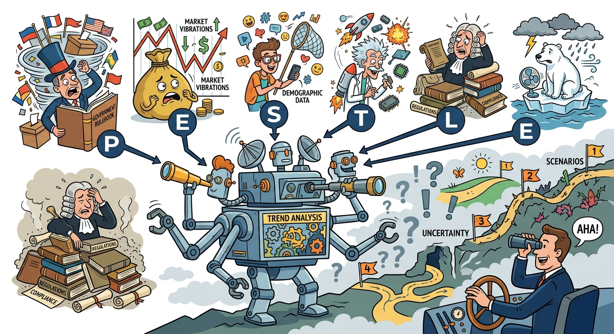

The contemporary global business environment illustrates an unprecedented level of volatility, which justifies the critical need for robust external analysis frameworks to secure competitive advantage. Navigating this immense complexity requires us to discuss PESTLE Analysis as a mechanism for categorizing macro-environmental forces, alongside Scenario Planning to formulate resilient strategies against unpredictable futures. Together, these analytical tools enable organizations to systematically decode systemic shifts—ranging from technological disruptions to regulatory mandates—and proactively align their strategic positioning to mitigate risks and capture emerging opportunities.

## Deconstructing the Macro-Environment via PESTLE Analysis
PESTLE Analysis serves as the foundational diagnostic framework for identifying the Political, Economic, Social, Technological, Legal, and Environmental forces that shape an industry's structural attractiveness and a firm's operational reality. The mechanism involves scanning the macro-environment to isolate variables that alter demand, cost structures, and competitive dynamics. 
*   **Political & Legal:** Regulatory mandates and geopolitical tensions significantly constrain strategic choices. For instance, Apple’s operations are heavily influenced by the European Union’s Digital Markets Act and USB-C mandates, alongside US Department of Justice antitrust investigations and geopolitical friction in China. Similarly, automotive suppliers like Delta/Signal must navigate the political threat of Chinese regulations requiring proprietary technology sharing.
*   **Economic & Social:** Fluctuating economic cycles and demographic shifts dictate consumer willingness to pay. The "Cola Wars" illustrate a profound social shift as health-conscious consumers pivot away from carbonated soft drinks toward bottled water and wellness beverages, forcing Coca-Cola and Pepsi to radically alter their product portfolios. Economically, the rise of the middle class in emerging markets justifies aggressive geographic expansion, as seen in Starbucks' premium positioning in China or Tanishq's localized "GoldPlus" strategy targeting India's rural economic demographics.
*   **Technological & Environmental:** The rapid advancement of Artificial Intelligence and agent-led orchestration is fundamentally redefining workforce tasks and organizational structures, demanding continuous technological adaptation. Environmentally, climate change and sustainability imperatives directly impact raw material supply chains. The Ferrero Group’s strategic imperative to achieve 100% sustainable cocoa and palm oil by 2020 was a direct response to environmental degradation and the resulting price volatility of agricultural commodities.

## The Mechanism of Scenario Planning for Strategic Uncertainty
While PESTLE identifies the variables, Scenario Planning provides the mechanism to manage the inherent uncertainty of these macro-forces. The process requires firms to isolate two high-impact, high-uncertainty variables (e.g., speed of technological adoption vs. severity of regulatory intervention) to construct a matrix of plausible future states. Rather than relying on a single static forecast, firms develop distinct strategic narratives for each quadrant. For example, Delta/Signal's executive team utilized scenario planning by developing divergent strategies: two targeting economy-segment OEMs (capitalizing on a slow economic recovery and Asian market growth) and two targeting luxury OEMs (betting on innovation and premium pricing). The implication of this framework is that it prevents strategic "straddling." By outlining clear, actionable contingency plans, organizations can rapidly pivot investments—such as Apple accelerating manufacturing relocation to India in response to the scenario of prolonged supply chain disruptions or escalating US-China trade wars.

## Integrating External Realities with Internal Strategic Fit
The ultimate implication of PESTLE Analysis and Scenario Planning is their direct influence on a firm’s internal architecture and resource allocation. Macro-environmental shifts invariably necessitate a reconfiguration of the firm's value chain and structural design to maintain a strategic fit. When environmental forces threaten supply chain stability—such as the severe weather patterns impacting Turkey’s hazelnut crops—firms like Ferrero justify aggressive vertical integration (acquiring the Oltan Group) to secure critical inputs and defend their core competencies. Furthermore, as technological macro-trends (like GenAI) advance, the internal workforce strategy must adapt; hierarchical structures must flatten into agile, cross-functional pods to remain competitive. Ultimately, external analysis dictates the strategic imperatives that must be supported by the firm’s VRIO (Valuable, Rare, Inimitable, Organized) resources, ensuring that the organization does not merely react to the environment, but proactively shapes its competitive posture.

In summary, mastering the macro-environment through PESTLE Analysis and Scenario Planning is indispensable for sustaining competitive advantage in a dynamic global landscape. By systematically decoding political, economic, social, technological, legal, and environmental variables, firms can construct plausible future scenarios rather than relying on fragile, static forecasts. This proactive approach ensures that strategic choices—whether pivoting product portfolios, reconfiguring global supply chains, or restructuring organizational hierarchies—remain resilient, adaptive, and tightly aligned with the external realities shaping the industry's future.