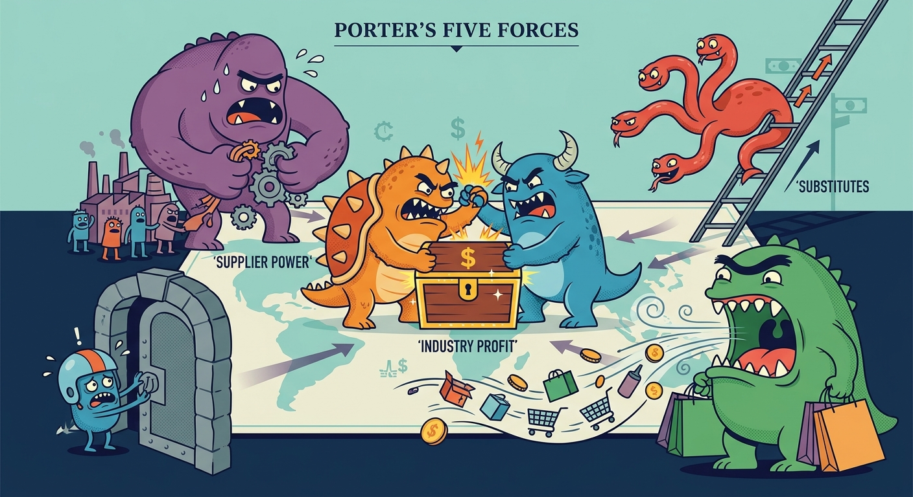

The study of external industry environments illustrates the critical need to evaluate market attractiveness and potential profitability through the lens of Porter's Five Forces. This analytical model justifies strategic positioning by assessing the intricate balance of power between existing competitors, potential entrants, supply chain partners, and alternative solutions. Analyzing this framework requires us to discuss three key dimensions: the internal dynamics of the industry (Rivalry and Entry Threats), the vertical power structures (Buyer and Supplier Power), and the external boundary pressures (Threat of Substitutes).

## Internal Industry Dynamics: Rivalry and Threat of Entry
Inter-firm rivalry is frequently the most powerful of the five forces, dictated by industry concentration, market growth rates, exit barriers, and the ratio of fixed to variable costs. When products lack differentiation or growth stagnates, firms often resort to destructive price competition. Concurrently, the threat of new entrants is determined by the height of entry barriers—such as economies of scale, capital requirements, learning curve effects, and patents—as well as the expected retaliation from incumbents. The *Cola Wars* case illustrates this perfectly; Coca-Cola and Pepsi established massive entry barriers through billion-dollar advertising budgets, global bottling networks, and fierce retaliatory pricing, keeping the intensity of rivalry high but effectively locking out new major players. Similarly, in the *Apple Inc.* case, the smartphone industry's high capital requirements and Apple’s proprietary technological ecosystem (iOS) act as formidable barriers to entry. Strategically, managers must evaluate these internal dynamics to determine whether to invest in raising structural barriers (like patents or scale) or to differentiate their offerings to avoid margin-eroding price wars.

## Vertical Power Structures: Bargaining Power of Buyers and Suppliers
A firm’s ability to capture the value it creates is heavily constrained by the bargaining power of its vertical chain partners. Supplier power is high when inputs are rare, suppliers are highly concentrated, or the firm faces steep switching costs. Buyer power escalates when customers purchase in massive volumes, face low switching costs, or purchase undifferentiated, standard supplies. In the *Apple* case, supplier power is a tangible threat; specialized component providers like Qualcomm (controlling CDMA/LTE patents) and ARM wielded significant leverage, which justified Apple’s strategic move to vertically integrate by developing its own in-house silicon chips to protect margins. Conversely, the *Delta/Signal Corp.* case highlights immense buyer power, where large OEM automakers dictate terms to fragmented electrical suppliers. To mitigate vertical threats, strategic managers must design mechanisms that lock in customers—such as Apple's high-switching-cost App Store ecosystem—or neutralize supplier dominance through backward integration and supply chain diversification.

## External Boundary Pressures: Threat of Substitutes
Substitutes place a hard ceiling on an industry’s pricing power by offering different goods or services that satisfy the same core customer need (e.g., tap water versus soft drinks, or aluminum versus steel). The threat of substitutes becomes severe when alternative products are readily available, attractively priced, or offer a superior performance-to-price ratio with minimal buyer switching costs. The *Cola Wars* context demonstrates this boundary pressure vividly: as socio-cultural trends shifted toward health and wellness, traditional carbonated soft drinks faced massive substitute threats from bottled water (Dasani/Aquafina), sports drinks (Gatorade), and energy drinks. Both Coke and Pepsi had to aggressively acquire or develop these substitutes to maintain their market dominance. Similarly, the *Café Coffee Day (CCD)* case requires us to understand how CCD positioned its premium experiential café culture against the ubiquitous and highly affordable substitute of traditional Indian street tea (chai). Managing this force implies that firms must constantly scan the broader environmental landscape for technological or social shifts and continuously enhance their value proposition to prevent customer defection.

## Conclusion
Ultimately, Porter's Five Forces provides a comprehensive architecture for diagnosing the structural constraints and profit potential of any industry. By systematically evaluating competitive rivalry, the barriers confronting new entrants, the leverage wielded by suppliers and buyers, and the looming presence of substitute products, organizations can accurately pinpoint their strategic vulnerabilities. Mastering this external analysis framework empowers firms to craft deliberate, well-aligned strategies that shield them from hostile competitive pressures and carve out a defensible, sustainable competitive advantage in the marketplace.