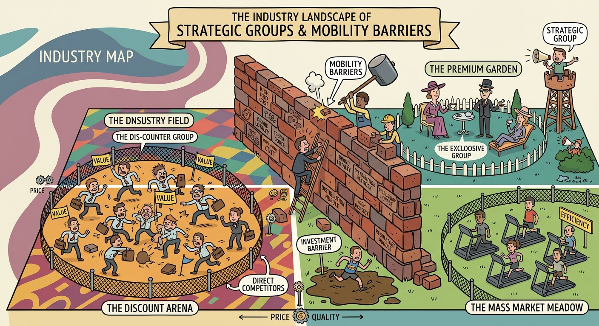

The concept of strategic groups illustrates how firms within an industry cluster together based on similar competitive approaches and market positions. Analyzing these clusters justifies the strategic necessity of mapping an industry to identify direct competitors and uncover distinct profit potentials across different market segments. Consequently, this topic requires us to discuss the mechanics of strategic group mapping, the intense nature of intra-group rivalry, and the critical role of mobility barriers that prevent fluid movement across competitive boundaries.

## Strategic Group Mapping and Competitive Positioning

Industry mapping is a systematic mechanism used to cluster firms that share two or more competitive characteristics, such as similar price/quality ranges, geographic coverage, or distribution channels. The process involves four key steps: identifying differentiating competitive characteristics, plotting firms on a two-variable map, assigning them to a shared strategy space, and drawing circles proportional to the group's share of total industry sales. By mapping the industry, firms can visualize their competitive positioning relative to peers. For example, within the Indian Auto Industry, plotting "Price/Quality" against "Dealer Network" reveals distinct strategic groups: Maruti and Tata cluster in the low-price/high-network space, while luxury brands like Audi and Mercedes occupy the high-price/low-network space. Similarly, the *Delta/Signal* case highlights the need to choose a clear competitive position by deciding whether to cluster with suppliers targeting the "economy segment" (competing on low initial cost and lean manufacturing) or the "luxury segment" (competing on innovation and deep customer integration).

## Intra-Group Rivalry and Profit Potential

The fundamental implication of a strategic group map is that the closer different groups are to one another, the stronger the competitive rivalry between their members. Firms within the same strategic group are direct competitors; they rely on identical technological approaches, offer similar services, and target identical buyer segments. Because they share a strategic profile, driving forces and competitive pressures—such as the Five Forces—exert a similar impact on all members of that group. However, the profit potential of different strategic groups varies significantly due to the inherent strengths and weaknesses of each group's market position. This dynamic is perfectly illustrated by the *Cola Wars*, where Coca-Cola and Pepsi form an elite strategic group of massive global concentrate producers. Their shared strategic profile subjects them to identical competitive forces (e.g., bargaining power of consolidated bottlers and retail channels) and forces them into fierce, head-to-head intra-group rivalry that dictates the profitability of the entire segment, distinct from smaller, regional private-label brands.

## Mobility Barriers and Strategic Opportunities

A company may desire to move from one strategic group to another where competitive forces are weaker and higher profits are possible; however, this movement is heavily restricted by mobility barriers. Mobility barriers function exactly like industry entry and exit barriers, but they exist *between* strategic groups within the same industry. Overcoming these barriers requires significant resource reallocation, structural changes, and shifts in brand perception. Identifying these barriers helps firms recognize uncontested "strategic spaces" or potential threats. In the *Tanishq* case, Titan Industries faced severe mobility barriers when attempting to move from its premium, Westernized 18-karat "jewelry as adornment" group into the mass-market, 22-karat "gold as investment" group. The structural rigidities of Tanishq's high-end brand perception, upscale store ambiance, and pricing markups made it nearly impossible to capture the semi-urban and rural market segments. This justified the creation of the distinct *GoldPlus* brand, strategically designed to bypass those mobility barriers and successfully position the firm in a highly profitable, untapped strategic space.

Ultimately, the analysis of strategic groups and mobility barriers provides a structured framework for understanding industry fragmentation and competitive dynamics. By isolating clusters of direct competitors and mapping their strategic dimensions, organizations can accurately evaluate their relative market positioning and vulnerability to external industry forces. Recognizing the structural rigidities imposed by mobility barriers prevents ill-advised market repositioning and enables firms to deliberately target uncontested strategic spaces for sustainable competitive advantage.