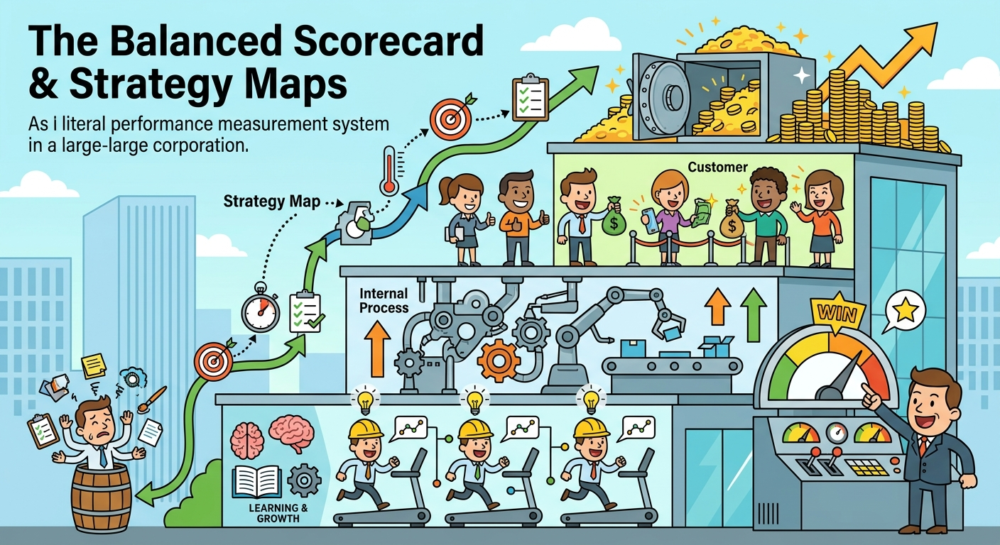

The study of the Balanced Scorecard and Strategy Maps requires us to discuss the fundamental mechanisms by which organizations translate high-level strategic visions into actionable, measurable operational goals. This framework illustrates how focusing solely on financial metrics is insufficient for sustained competitive advantage, necessitating a multi-dimensional approach to performance evaluation. Furthermore, the integration of these tools justifies the alignment of organizational resources, departmental budgets, and daily activities with long-term objectives across financial, customer, internal process, and learning and growth dimensions.

## The Four Perspectives of the Balanced Scorecard
The Balanced Scorecard (BSC) fundamentally revolutionizes performance management by viewing the organization from four interrelated perspectives, thereby balancing lagging indicators (past outcomes) with leading indicators (future performance predictors). The **Financial Perspective** evaluates whether strategy execution is leading to bottom-line results, utilizing KPIs such as Return on Equity (ROE), gross profit margins, and asset turnover. The **Customer Perspective** identifies the value proposition targeted at specific market segments, measuring success through customer satisfaction, market share, and perceptions of quality or innovation. The **Internal Process Perspective** focuses on the critical operations that must be mastered to deliver the customer value proposition, tracked via metrics like assembly throughput rates, product defect rates, and R&D pipeline progression. Finally, the **Learning & Growth Perspective** targets the intangible assets—human, information, and organizational capital—required to support value-creating processes. As illustrated in the *Delta/Signal* turnaround case, measuring employee alignment via BSC quizzes or tracking the percentage of engineers trained in Total Quality Management (TQM) directly feeds into process improvements. 

## Strategy Maps: Visualizing Strategic Cause-and-Effect
A Strategy Map is a visual architecture that illustrates the cause-and-effect relationships linking the objectives across the four BSC perspectives. It provides a cohesive narrative of how value is created, transforming an assortment of isolated KPIs into an integrated strategic roadmap. For instance, a strategy map clarifies how an investment in Learning & Growth (e.g., training buyers in low-cost sourcing) directly impacts Internal Processes (e.g., improving supplier efficiency). This operational excellence subsequently enhances the Customer Perspective (e.g., building a reputation as a leading low-cost supplier), which ultimately drives Financial success (e.g., increased operating income margins). For companies struggling with strategic drift or overly complex operations—such as *Delta/Signal* and its uncoordinated 2,000 distinct products—the strategy map acts as a vital communication tool. It ensures that every manager and employee understands the firm's overarching value proposition, whether that is achieving "Low Lifetime Cost" for economy segments or "Innovation" for luxury segments.

## Linking Strategy Implementation to Resource Allocation and KPIs
The ultimate utility of the Balanced Scorecard and Strategy Maps lies in their ability to govern Strategy Implementation and resource allocation. Strategic objectives are operationalized only when paired with precise Key Performance Indicators (KPIs), targets, and funded initiatives. By explicitly linking departmental budgets to BSC initiatives, organizations prevent the misallocation of capital toward secondary drivers. As highlighted by corporate governance principles in *Creating Corporate Advantage* and the *Delta/Signal* case, historical performance gains are often lost when investment is prematurely diverted from core strategic programs. The BSC enforces sustained investment in the primary drivers of strategy. By monitoring leading indicators, executives can rapidly evaluate the effectiveness of funded initiatives—such as customer integration portals or Kaizen defect reduction programs—and dynamically reallocate resources to ensure that execution remains perfectly tethered to the strategic vision.

In conclusion, the Balanced Scorecard and Strategy Maps serve as indispensable instruments for executing strategic intent and sustaining organizational alignment. By balancing short-term financial outcomes with long-term value drivers across customer satisfaction, internal processes, and human capital development, firms can successfully avoid the pitfalls of myopic management. Ultimately, these frameworks ensure that every strategic initiative is purposefully tracked, funded, and interconnected, transforming abstract corporate strategies into tangible, measurable realities that drive enduring competitive advantage.