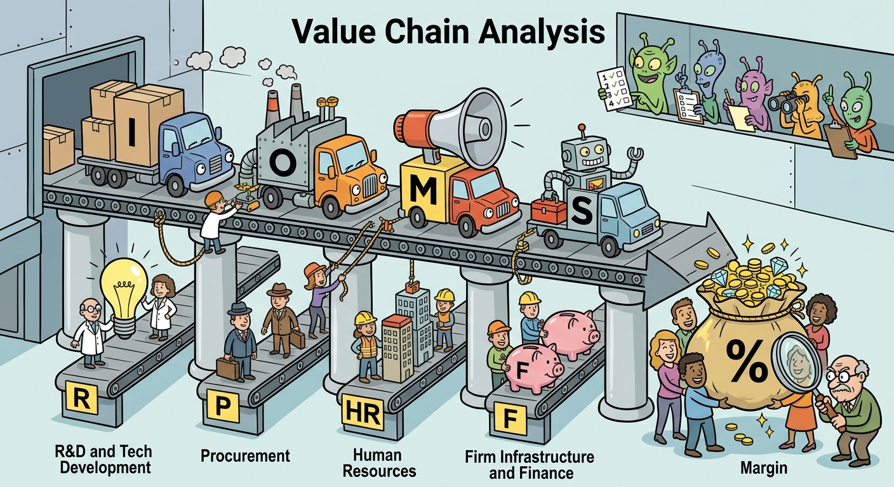

The framework of Value Chain Analysis systematically illustrates the internal configuration of a firm by disaggregating its strategic activities to identify the root sources of competitive advantage. Analyzing this framework requires us to discuss the dynamic interplay between a firm's primary and support activities, alongside the critical role of optimizing internal and external linkages. Furthermore, it justifies strategic decisions regarding value chain reconfiguration and industry benchmarking, allowing firms to capture superior margins and defend against market volatility or competitive imitation. 

## Deconstructing Primary and Support Activities
At the core of Value Chain Analysis is the separation of a firm’s operations into strategically relevant activities to understand behavior costs and existing or potential sources of differentiation. Primary activities are those directly concerned with the physical creation, sale, distribution, and post-sale support of a product or service. These include Inbound Logistics, Operations, Outbound Logistics, Marketing & Sales, and Service. For example, a firm pursuing a low-cost strategy might heavily optimize its Operations and Outbound Logistics to achieve scale economies. Conversely, Support activities—Procurement, Technology Development, Human Resource Management (HRM), and Firm Infrastructure—provide the necessary assistance for primary activities to take place. The margin a firm achieves is the difference between the total value (what customers are willing to pay) and the collective cost of performing these primary and support activities. Superior execution in any of these nodes—such as advanced technology development or highly efficient procurement—creates a tangible wedge between cost and customer willingness to pay.

## Optimizing and Coordinating Value Chain Linkages
Value chain activities are not isolated silos; they are highly interdependent. Linkages exist when the way one activity is performed affects the cost or effectiveness of another. Optimization of these linkages can lead to a distinct competitive advantage. For instance, purchasing higher-quality, pre-cut raw materials (Procurement/Inbound Logistics) may increase initial input costs but drastically reduce manufacturing scrap and subsequent Service costs. Furthermore, external linkages connect a firm’s value chain to the value chains of its suppliers and buyers. Effective coordination across these boundaries—such as integrating supplier engineering staff with internal technology development, or establishing onsite supplier quality engineers as seen in manufacturing case studies—eliminates operational friction, reduces inventory requirements, and enhances overall product quality. 

## Benchmarking and Value Chain Reconfiguration
To ensure the value chain remains competitive, organizations must engage in rigorous benchmarking, systematically comparing the costs and performance of their specific activities against "best-in-industry" practices. When benchmarking reveals inefficiencies, a firm must undertake value chain reconfiguration. This involves modifying, outsourcing, or entirely eliminating certain activities to bypass cost-producing steps that add little customer value. Strategic reconfiguration is also driven by the "smile of value creation," which illustrates that standard manufacturing often yields the lowest value-added margins, while upstream activities (R&D, design) and downstream activities (marketing, integrated customer solutions, after-sales services) capture the highest value. This dynamic justifies why many traditional product manufacturers structurally reconfigure their value chains to migrate downstream, capturing migrating value and escaping the commoditization of core physical products.

## Supply Chain Integration and Sustainability 
In modern strategic management, controlling the value chain extends beyond mere cost efficiency to encompass risk mitigation, ethical branding, and sustainability. As demonstrated by global confectionery leaders like the Ferrero Group, deep backward integration into the value chain (e.g., acquiring agricultural processors or establishing direct farming partnerships) secures the traceability and sustainability of raw materials. Aligning procurement and operations with Corporate Social Responsibility (CSR) objectives protects the firm against supply shocks and price volatility. Moreover, a transparent, sustainable value chain serves as a powerful differentiator in mature markets, effectively transforming backend support activities into front-end Marketing and Sales advantages that command premium pricing and deepen brand loyalty.

Ultimately, Value Chain Analysis transcends simple operational mapping to function as a dynamic diagnostic tool for strategic positioning. By rigorously evaluating primary and support activities, optimizing inter-activity linkages, and continuously benchmarking against industry standards, a firm can successfully reconfigure its operations. This continuous realignment ensures the firm maximizes its margin, adapts to shifting industry profit pools, and sustains a robust competitive advantage in an ever-evolving market environment.