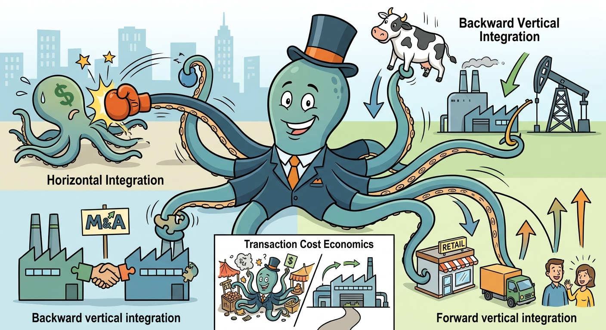

Corporate strategy dictates the boundaries of a firm, establishing where it should operate within an industry's value chain or across competing markets. This study note illustrates the fundamental mechanisms of vertical and horizontal integration, justifies these boundary choices through the lenses of Transaction Cost Economics (TCE) and modern learning imperatives, and requires us to discuss how mergers and acquisitions (M&A) are utilized to execute these expansion strategies. By analyzing diverse case evidence, we will examine how firms manipulate their scope to minimize transaction hazards, scale operations, and secure sustainable competitive advantage.

## Theoretical Foundations of Vertical Integration: TCE and Beyond
Vertical integration (VI) refers to a firm's expansion along its own industry value chain. Traditionally, the academic justification for VI rested heavily on Strategic Positioning and Efficient Governance. From a strategic standpoint, VI is utilized to foreclose input and output markets to competitors, cross-subsidize operations, and raise barriers to entry. From a governance perspective, Transaction Cost Economics (TCE) argues that integration minimizes the costs of market failure, specifically safeguarding against opportunism when highly customized, transaction-specific assets are involved (the "small numbers bargaining" problem). 

However, contemporary strategic management dictates that traditional motives for VI are evolving. Today, VI is increasingly driven by "value migration" downstream, the need for "integrated solutions," and the desire to build synergies across disparate value chain segments. Furthermore, as the internet and external outsourcing have reduced traditional search and transaction costs, modern VI is primarily motivated by the untradeable benefits of organizational learning and the synthesis of proprietary knowledge.

## Drivers and Mechanisms of Backward Integration
Backward integration occurs when a firm moves upstream along the value chain, acquiring its suppliers or establishing its own raw material and component manufacturing capabilities. The primary mechanism here is internalizing production to secure critical inputs, reduce price volatility, and control quality or sustainability standards. 

The syllabus provides several striking examples of backward integration mechanisms and their strategic implications:
*   **Securing Supply and Sustainability (M&A):** The Ferrero Group utilized backward M&A by acquiring the Turkish Oltan Group, the world's largest hazelnut processor. This secured a critical, price-volatile raw material supply and allowed Ferrero to implement traceability to meet its ambitious 2020 Corporate Social Responsibility (CSR) sustainability targets.
*   **Controlling Core Technologies:** Apple consistently backward integrates to control the critical technologies that drive product differentiation. Apple purchased Intel’s cellular modem business for $1 billion and acquired multiple ARM microprocessor companies to design its own internal silicon (e.g., M-series chips), thereby reducing reliance on suppliers like Qualcomm and Samsung. 
*   **Operational Cost Reduction:** Café Coffee Day (CCD) exhibits a fully backward-integrated model. By owning 11,000 acres of coffee plantations, operating its own curing mills, and even manufacturing its own café furniture and coffee machines, CCD drastically reduces its capital and raw material costs, enabling it to aggressively underprice global competitors like Starbucks.

## Drivers and Mechanisms of Forward Integration
Forward integration involves a firm moving downstream along the value chain, closer to the end consumer. The contemporary implication of forward integration is that capturing the customer interface allows a firm to acquire tacit, contextual knowledge about consumer behavior that cannot simply be outsourced or purchased via market contracts.

Key applications of forward integration include:
*   **Channel and Pricing Control:** In the Cola Wars, concentrate producers Coca-Cola and Pepsi historically relied on fragmented, independent bottlers. However, to regain control over retail pricing, supermarket shelf space, and distribution efficiency, both companies aggressively forward integrated by acquiring their largest independent bottlers to form massive "anchor bottlers" (Coca-Cola Enterprises and Pepsi Bottling Group).
*   **Owning the Consumer Experience:** Apple’s launch of its own retail stores acts as a forward integration mechanism. By controlling the retail environment, Apple transformed the point of sale into a "digital hub," educating consumers, showcasing tight hardware-software integration, and generating massive sales per square foot. 
*   **Service & Value Migration:** Delta/Signal Corporation considered a forward-integration strategy dubbed "Customer Integration" targeting luxury OEMs. By closely integrating its R&D and manufacturing processes with the design processes of a few key luxury auto customers, the firm aimed to capture higher margins and insulate itself from demand fluctuations.

## Horizontal Integration via Mergers and Acquisitions
Horizontal integration entails expanding a firm’s operations at the same level of the value chain, typically by acquiring competitors or merging with firms in the same or adjacent product markets. The strategic mechanism of horizontal M&A is designed to rapidly achieve economies of scale, expand geographic footprint, eliminate competition, and broaden a firm's product portfolio. 

Firms utilize horizontal integration to execute rapid strategic shifts:
*   **Rapid Market Penetration:** Nestlé executed a multi-billion dollar horizontal M&A strategy to transform into a Nutrition, Health, and Wellness (NHW) powerhouse. By acquiring Jenny Craig (weight management), Uncle Toby's (health cereals), Novartis Medical Nutrition, and Gerber (baby foods for $5.5 billion), Nestlé horizontally expanded its product scope to capture market share in high-margin functional foods.
*   **Category Expansion:** Ferrero horizontally integrated by acquiring Thorntons (to gain immediate access to the UK premium chocolate retail market) and Delacre (to enter the new gourmet cookie segment and penetrate the US market). 
*   **Consolidating Market Position:** Cadbury Schweppes built its position as the third-largest US soft drink manufacturer entirely through horizontal M&A, acquiring established brands like Dr Pepper, Seven-Up, and Snapple to compete with the sheer scale of Coke and Pepsi.

## Conclusion
Vertical and horizontal integration represent foundational corporate strategies that define a firm's competitive boundaries. While horizontal integration leverages M&A to rapidly scale market power, consolidate competition, and broaden product scope, vertical integration is deployed to neutralize transaction hazards, secure volatile supply chains, and capture shifting downstream value. Ultimately, the successful execution of these integration strategies depends on a firm's ability to seamlessly align its governance structures with its overarching strategic goals, thereby capturing unique learning opportunities and sustaining long-term corporate advantage.